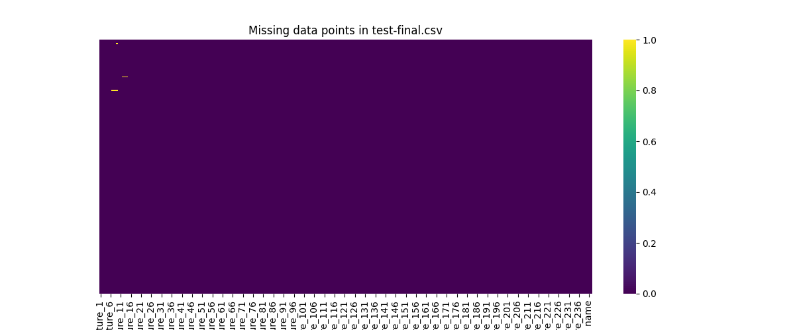
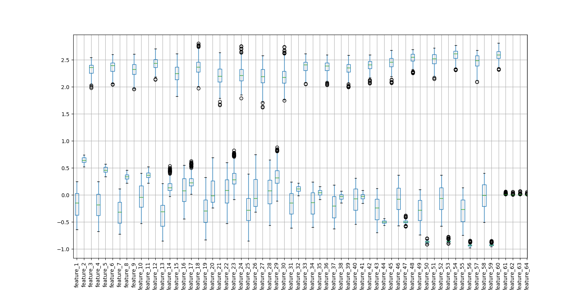
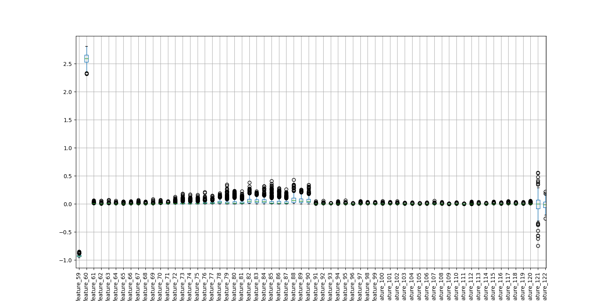
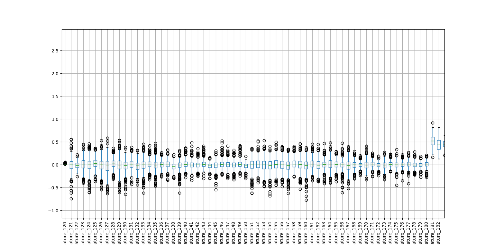
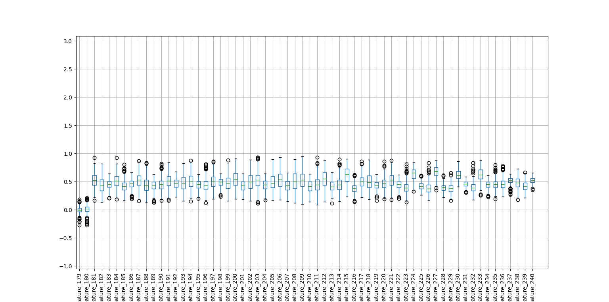
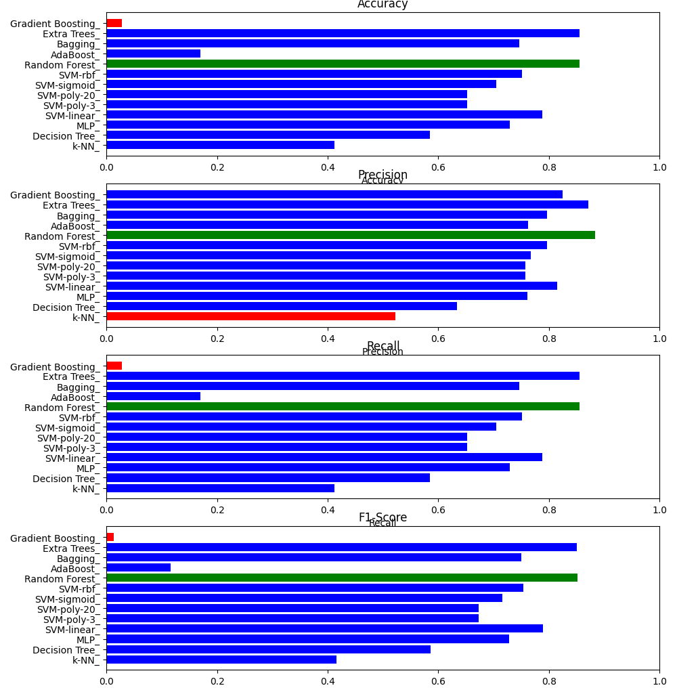
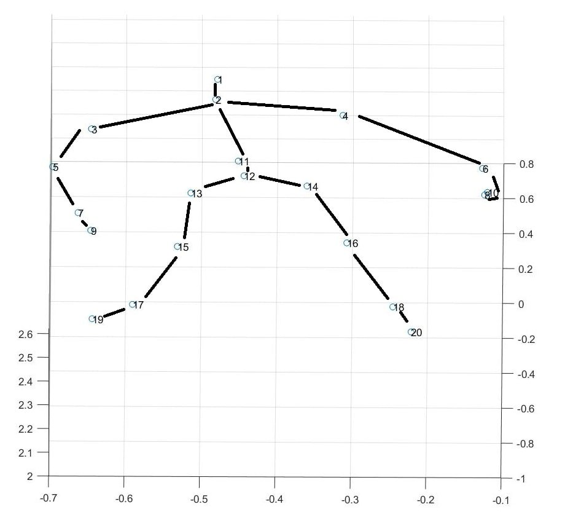

## Data Exploration & Visualization

Before training the models, the gesture recognition dataset was carefully analyzed to understand its structure and statistical properties.

The analysis focused on:

- Class balance
- Missing values
- Feature scaling
- Feature variability
- Model performance comparison

For readers interested in deeper technical details, see:
- [Feature Engineering Details](#feature-engineering-details)
- [Normalization Method](#normalization-method)
- [Model Selection Rationale](#model-selection-rationale)

---

### Label Distribution

  
   
  <em>Label distribution for the training set</em>

  
   
  <em>Label distribution for the test set</em>

The gesture classes are approximately balanced in both datasets.  
Balanced labels reduce model bias and support fair evaluation.

---

### Missing Data Check

  

  

The heatmaps confirm that missing values are negligible, indicating good data integrity.

---

### Feature Variability (Boxplots)

  

  

  

  

The boxplots show structured variability across feature groups, suggesting meaningful differences between gesture classes.

---

### Model Comparison

  

Random Forest and Extra Trees achieved the strongest performance (~85% accuracy).  
Detailed reasoning is provided in the section below.

---

## Feature Engineering Details

The dataset originates from 20 tracked body joints captured using a Kinect sensor.

From the raw joint coordinates, additional features were derived:

- Pairwise cosine similarities between joint vectors
- Relative distances between selected joints
- Aggregated statistics capturing movement trends

These features encode spatial structure and relational information, transforming raw coordinates into structured representations suitable for classical ML models.

---

## Normalization Method

Because joint coordinates and derived features operate on different numeric scales, normalization was applied to:

- Align feature magnitudes
- Reduce skewness
- Improve numerical stability during training

This ensures that no single feature disproportionately influences the model.

---

## Model Selection Rationale

Ensemble-based tree methods (Random Forest and Extra Trees) performed best because:

- They handle structured tabular data well
- They are robust to feature scaling differences
- They capture nonlinear relationships effectively

Gradient Boosting showed slightly lower performance, likely due to limited hyperparameter tuning.

---

## Gesture Skeleton Reconstruction

  
   
  <em>2D skeletal reconstruction from Kinect joint coordinates</em>

The skeleton representation illustrates how joint coordinates form the structural basis of the gesture features.

---

## Summary

- Dataset is balanced and clean  
- Features capture meaningful spatial relationships  
- Normalization ensures stable training  
- Random Forest and Extra Trees achieved ~85% accuracy  

Future work includes extending this approach toward temporal modeling and spiking neural network architectures.
