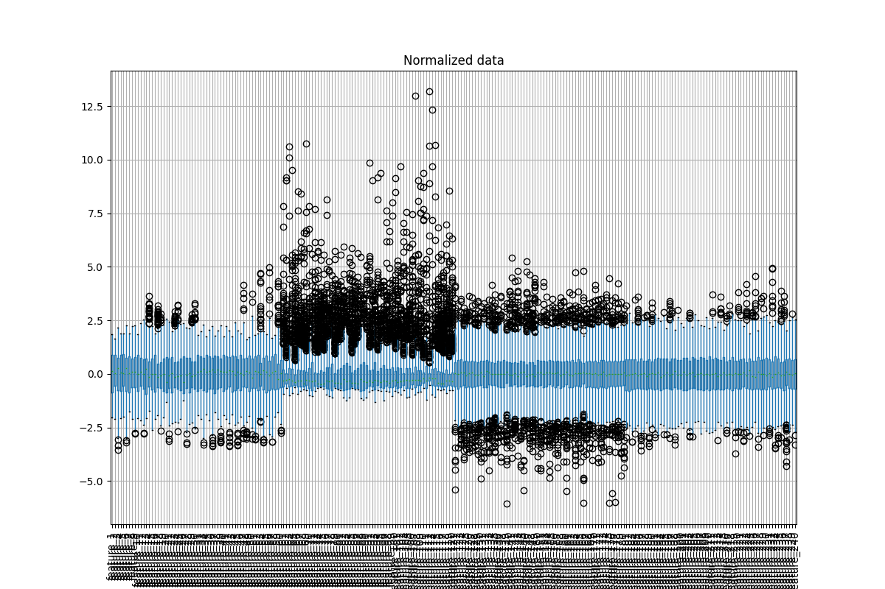

## Data Exploration & Visualization

The gesture recognition dataset was analyzed through a series of exploratory visualizations,  
including distribution, normalization, and missing-value heatmaps.

---

### Label Distribution

  
   
  <em>Label histogram for train-final.csv</em>

  
   
  <em>Label histogram for test-final.csv</em>

The gesture labels are approximately balanced,  
ensuring fair training without dominant class bias.

---

### Missing Data Check

  

  

Both datasets show negligible missing values — confirming data integrity before preprocessing.

---

### Data Normalization

  

  

  

Normalization aligns feature scales and eliminates skewness,  
creating a well-centered input distribution suitable for ML models.

---

### Boxplot Feature Analysis

  

  

  

  

Feature groups reveal the structural variability across joint position, cosine, and mean features.

---

### Model Comparison

  

Random Forest and Extra Trees outperform other classifiers  
with ~85% accuracy, while Gradient Boosting struggled due to limited tuning.

---

### Gesture Skeleton Reconstruction

  
   
  <em>2D skeletal reconstruction from Kinect joint coordinates</em>

The skeleton graph represents the spatial relationship of 20 tracked joints,  
forming the raw basis for cosine and distance-based feature extraction.

---

### Summary

- **Data quality**: clean and balanced  
- **Normalization**: stable across both datasets  
- **Feature diversity**: visible structure clusters  
- **Top models**: Random Forest, Extra Trees  
- **Next step**: spiking neural network simulation for gesture sequences
